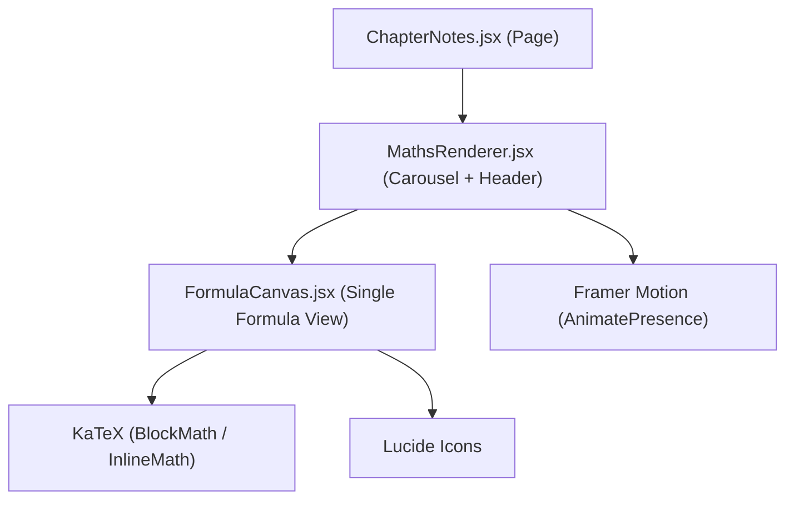

# Mathematics Chapter Page — Complete Design & UI Specification

## 1. Overview

The Mathematics chapter page is a **formula-centric learning interface** for CBSE Class 12 students. It presents one formula at a time in a **carousel-style layout** with a dark, premium aesthetic. Each formula is displayed as a hero card with supporting content sections organized below it.

**URL Pattern:** `/subjects/mathematics/chapters/{chapter-slug}/notes`  
**Tech Stack:** React 18 + Vite + Tailwind CSS + Framer Motion + KaTeX + Lucide Icons

---

## 2. Component Architecture



### File Locations
| Component | Path | Lines | Role |
|-----------|------|-------|------|
| [ChapterNotes.jsx](file:///d:/Drive%20E/StudentAssist-main/StudentAssist-main/src/pages/ChapterNotes.jsx) | [src/pages/ChapterNotes.jsx](file:///d:/Drive%20E/StudentAssist-main/StudentAssist-main/src/pages/ChapterNotes.jsx) | 347 | Parent page, data loading, routing |
| [MathsRenderer.jsx](file:///d:/Drive%20E/StudentAssist-main/StudentAssist-main/src/components/Maths/MathsRenderer.jsx) | [src/components/Maths/MathsRenderer.jsx](file:///d:/Drive%20E/StudentAssist-main/StudentAssist-main/src/components/Maths/MathsRenderer.jsx) | 197 | Carousel wrapper, header bar, navigation |
| [FormulaCanvas.jsx](file:///d:/Drive%20E/StudentAssist-main/StudentAssist-main/src/components/Maths/FormulaCanvas.jsx) | [src/components/Maths/FormulaCanvas.jsx](file:///d:/Drive%20E/StudentAssist-main/StudentAssist-main/src/components/Maths/FormulaCanvas.jsx) | 323 | Individual formula display with all content sections |

### Parent Wrapper (ChapterNotes.jsx)
For Mathematics, the parent page:
- Hides its own nav bar and background elements (`{!isMathematics && ...}`)
- Uses `w-full px-0` on `<main>` instead of `container-app` (which applies `max-w-5xl`)
- Wraps MathsRenderer in `<div className="w-full dark-katex">` — the `dark-katex` CSS class forces all KaTeX elements to render in **white (#f5f5f4)** instead of inheriting the body's dark color

---

## 3. JSON Data Schema

Each chapter JSON file follows this structure:

```json
{
  "chapter_name": "Integrals",
  "board": "CBSE",
  "class": "12",
  "exam_year": "2026",
  "formulas": [
    {
      "formula_number": 1,
      "formula_title": "Power Rule of Integration",
      "section_A": {
        "latex_formula": "$$\\int x^n dx = \\frac{x^{n+1}}{n+1} + C$$",
        "derived_forms": ["$$\\int (ax+b)^n dx = ...$$"],
        "special_cases": ["$$\\int \\sqrt{x} dx = ...$$"]
      },
      "section_B": {
        "when_to_use": "When integrating polynomial terms...",
        "trigger_keywords": ["polynomial", "root x"],
        "question_types": ["MCQ", "2_mark"],
        "common_mistakes": ["Forgetting +C..."],
        "board_traps": ["Providing 1/x^3..."],
        "examiner_twist_pattern": "Mixing algebraic terms..."
      },
      "section_C": {
        "why_students_fail": "Rushing through...",
        "how_to_think": "Integration is anti-derivation...",
        "thirty_second_strategy": "Convert all radicals...",
        "mental_shortcut": "Power up, divide by new power.",
        "micro_example": "$$\\int \\frac{1}{x^2} dx = ...$$"
      }
    }
  ]
}
```

### Section Breakdown
| Section | Purpose | Content Type |
|---------|---------|-------------|
| **section_A** | The formula itself | LaTeX (wrapped in `$$...$$`) |
| **section_B** | Exam strategy & traps | Mixed text + occasional LaTeX |
| **section_C** | Learning strategy | Mixed text, mental shortcuts, worked examples |

> [!IMPORTANT]
> All sections are **optional** — the component uses `?.` optional chaining throughout. A formula may have only `section_A`, or all three.

---

## 4. Visual Design System

### 4.1 Color Palette

| Element | Color | Tailwind Class |
|---------|-------|---------------|
| **Page Background** | `#060610` (near-black blue) | `bg-[#060610]` |
| **Hero Formula Card** | `#08081A` (slightly lighter) | `bg-[#08081A]` |
| **Card Backgrounds** | `rgba(255,255,255, 0.02)` | `bg-white/[0.02]` |
| **Card Borders** | `rgba(255,255,255, 0.06)` | `border-white/[0.06]` |
| **Primary Text** | White | `text-white` |
| **Body Text** | `rgba(255,255,255, 0.8)` | `text-white/80` |
| **Labels** | `rgba(255,255,255, 0.6)` | `text-white/60` |
| **Muted Text** | `rgba(255,255,255, 0.4-0.5)` | `text-white/40` to `text-white/50` |

### 4.2 Accent Colors per Card Type

| Card | Background | Border | Icon Color |
|------|-----------|--------|------------|
| **When to Use** | `bg-sky-950/20` | `border-sky-500/10` | `text-sky-400` |
| **Common Mistakes** | `bg-rose-950/20` | `border-rose-500/10` | `text-rose-400` |
| **Board Traps** | `bg-orange-950/20` | `border-orange-500/10` | `text-orange-400` |
| **Why Students Fail** | `bg-purple-950/20` | `border-purple-500/10` | `text-purple-400` |
| **How to Think** | `bg-fuchsia-950/20` | `border-fuchsia-500/10` | `text-fuchsia-400` |
| **30-Second Strategy** | `bg-indigo-950/20` | `border-indigo-500/10` | `text-indigo-400` |
| **Mental Shortcut** | `bg-amber-950/20` | `border-amber-500/10` | `text-amber-400` |
| **Micro Example** | `bg-emerald-950/15` | `border-emerald-500/10` | `text-emerald-400` |
| **Derived Forms** | `bg-white/[0.02]` | `border-white/[0.06]` | `text-amber-400` (Zap icon) |
| **Special Cases** | `bg-white/[0.02]` | `border-white/[0.06]` | `text-emerald-400` (Target icon) |

### 4.3 Background Effects
- **Two ambient glow orbs**: `500px × 500px` blurred circles (`blur-[150px]`), `indigo-600/10` and `purple-600/10`, positioned at top-left 5% and bottom-right 5%
- **Hero card ambient glow**: Central `400px × 250px` indigo glow (`blur-[100px]`) that intensifies on hover via `group-hover`
- All glows use `pointer-events-none` so they don't interfere with interaction

### 4.4 Typography
- **Font Family**: `Plus Jakarta Sans` (body) / `Outfit` (headings) — imported from Google Fonts
- **Formula Title**: `text-2xl sm:text-3xl font-bold tracking-tight` (white)
- **Chapter Name in Header**: `text-lg sm:text-xl font-bold` (white)
- **Card Section Headers**: `text-white font-semibold` (full white)
- **Card Label Headers** (uppercase): `text-xs uppercase tracking-widest font-semibold text-white/60`
- **Body Content Text**: `text-[15px] leading-relaxed text-white/80`
- **Keywords Pills**: `text-xs font-medium text-white/70`

### 4.5 Spacing System
- **Outer Container Padding**: `pt-16 px-4 sm:px-8 lg:px-12`
- **Content Area Padding**: `px-6 sm:px-10 lg:px-16 py-10`
- **Card Internal Padding**: `p-8` (all cards)
- **Hero Formula Padding**: `p-10 sm:p-14`
- **Section Spacing**: `mb-10` between major sections
- **Card Grid Gap**: `gap-6`
- **Inner Element Spacing**: `mb-5` between card header and content, `space-y-3` for list items

### 4.6 Border Radius
- **Cards**: `rounded-2xl` (1rem)
- **Hero Formula Card**: `rounded-[2rem]`
- **Icon Containers**: `rounded-xl` (0.75rem)
- **Formula Number Badge**: `rounded-2xl` (1rem)
- **Keyword Pills**: `rounded-full`
- **Header Bar**: `rounded-2xl`

---

## 5. Page Layout (Top to Bottom)

### Layer 1: Progress Bar (Fixed)
```
┌────────────────────────────────────────────┐
│ ██████████░░░░░░░░░░░░░  (indigo→purple)   │  ← fixed top-0, h-1, z-50
└────────────────────────────────────────────┘
```

### Layer 2: Global Navbar (External — from App.jsx)
```
┌────────────────────────────────────────────┐
│ ← L  Lumina    Subjects  MockTests  Search │  ← ~56px (top-14)
└────────────────────────────────────────────┘
```

### Layer 3: Chapter Header Bar (Static, inside MathsRenderer)
```
┌────────────────────────────────────────────┐
│ [∑] Relations & Functions    ‹ [1/13] ›    │  ← glassmorphic card
│     CBSE Class 12                          │
│ ━━━━━ ● ● ● ● ●  ○ ○ ○ ○ ○ ○ ○ ○        │  ← dot indicators
└────────────────────────────────────────────┘
```

- **Left**: `∑` icon (indigo→purple gradient badge) + chapter name + board info
- **Right**: `‹` prev button + `X / Y` counter + `›` next button
- **Bottom row**: Clickable dot indicators (active = `w-8 bg-indigo-500`, visited = `w-3 bg-indigo-500/40`, unvisited = `w-3 bg-white/10`). Only shown when ≤25 formulas.

### Layer 4: Formula Canvas (Animated, one at a time)
```
┌──────────────────────────────────────────────────────────┐
│ [1]  Reflexive Relation                                  │  ← Formula header
│                                                          │
│ ┌──────────────────────────────────────────────────────┐ │
│ │                                                      │ │
│ │          (a, a) ∈ R  for every  a ∈ A                │ │  ← HERO FORMULA
│ │                 (KaTeX BlockMath)                     │ │     with ambient glow
│ └──────────────────────────────────────────────────────┘ │
│                                                          │
│ ┌─── Derived Forms ──────┐  ┌─── Special Cases ────────┐ │
│ │ ⚡ aRa for all a ∈ A   │  │ 🎯 I_A ⊆ R (identity..) │ │  ← 2-column grid
│ └────────────────────────┘  └──────────────────────────┘ │
│                                                          │
│ ┌─ When to Use ─┐ ┌─ Common Mistakes ─┐ ┌─ Board Traps ┐│
│ │ 💡 ...        │ │ ⚠️ — mistake 1     │ │ 🛡️ — trap 1  ││  ← 3-column grid
│ │               │ │    — mistake 2     │ │              ││
│ └───────────────┘ └───────────────────┘ └──────────────┘│
│                                                          │
│ ┌─── Examiner's Twist ──────────┐ ┌─ Expected In ──────┐│
│ │ Using completing the square.. │ │ [MCQ] [2 mark]     ││  ← flex-wrap row
│ └───────────────────────────────┘ └────────────────────┘│
│                                                          │
│ ┌─ Why Fail ─────────┐  ┌─ How to Think ──────────────┐ │
│ │ 🧠 ...              │  │ 🔬 ...                      │ │  ← 2-column grid
│ ├─ 30-Sec Strategy ──┤  ├─ Mental Shortcut ───────────┤ │
│ │ ⏱️ ...              │  │ ⚡ "Reflexive = Mirrors..." │ │
│ └────────────────────┘  └─────────────────────────────┘ │
│                                                          │
│ ┌────── Micro Example ─────────────────────────────────┐ │
│ │ 📖  Set A = {1,2}. R = {(1,1),(2,2),(1,2)} → yes  │ │  ← full-width
│ └──────────────────────────────────────────────────────┘ │
│                                                          │
│ KEYWORDS  [reflexive]  [related to itself]  [equivalence]│  ← pill tags
└──────────────────────────────────────────────────────────┘
```

---

## 6. Animations & Interactions

### 6.1 Carousel Transition (Framer Motion)
```javascript
// Slide in from right (+600px) or left (-600px) depending on direction
enter:  { x: direction > 0 ? 600 : -600, opacity: 0 }
center: { x: 0, opacity: 1 }
exit:   { x: direction < 0 ? 600 : -600, opacity: 0 }

// Physics-based spring animation
transition: { x: { type: "spring", stiffness: 300, damping: 30 }, opacity: { duration: 0.2 } }
```

### 6.2 Swipe Gesture
- `drag="x"` with `dragConstraints={{ left: 0, right: 0 }}`
- `dragElastic={1}` for rubber-band feel
- Swipe threshold: `Math.abs(offset.x) * velocity.x` > 10000 triggers next/prev

### 6.3 Keyboard Navigation
- `ArrowRight` → next formula
- `ArrowLeft` → previous formula

### 6.4 Progress Bar
- Animated width from `0%` to [(page+1)/total * 100%](file:///d:/Drive%20E/StudentAssist-main/StudentAssist-main/src/App.jsx#23-58)
- `ease-in-out` transition, 0.4s duration

### 6.5 Hover Effects
- Hero formula card: ambient glow intensifies (`group-hover:bg-indigo-500/[0.14]`, 1s transition)
- Keyword pills: `hover:text-white/90 hover:border-white/10`
- Nav buttons: `hover:bg-white/10 hover:text-white`

---

## 7. LaTeX Rendering Pipeline

### 7.1 Three-Stage Processing

**Stage 1: [processLatex(str)](file:///d:/Drive%20E/StudentAssist-main/StudentAssist-main/src/components/Maths/FormulaCanvas.jsx#7-11)** — For dedicated formula fields (`section_A.latex_formula`, derived forms, special cases, micro example)
- Strips `$$...$$` and `$...$` delimiters
- Feeds clean LaTeX to `<BlockMath math={...} />`

**Stage 2: [preprocessMathText(text)](file:///d:/Drive%20E/StudentAssist-main/StudentAssist-main/src/components/Maths/FormulaCanvas.jsx#12-33)** — Auto-detection for plain text fields
- Skips if text already contains `$` delimiters
- Regex finds tokens containing `^`, `_`, or `√`
- Converts function names to LaTeX: `sin` → `\sin`, `tan` → `\tan`, etc.
- Braces exponents: `^-1` → `^{-1}`, `^2` → `^{2}`
- Wraps detected math in `$...$` delimiters

**Stage 3: [renderTextWithLatex(text)](file:///d:/Drive%20E/StudentAssist-main/StudentAssist-main/src/components/Maths/FormulaCanvas.jsx#34-60)** — Final rendering
- Calls [preprocessMathText](file:///d:/Drive%20E/StudentAssist-main/StudentAssist-main/src/components/Maths/FormulaCanvas.jsx#12-33) first
- Splits on `$$...$$ and `$...$` patterns
- Renders `$$...$$` as `<BlockMath>` and `$...$` as `<InlineMath>`
- Falls back to `<code>` on parse errors

### 7.2 CSS for KaTeX on Dark Background
The `dark-katex` CSS class (defined in [index.css](file:///d:/Drive%20E/StudentAssist-main/StudentAssist-main/src/index.css)) forces all KaTeX elements to `color: #f5f5f4 !important`, including fraction lines, sqrt rules, and all math elements.

### 7.3 KaTeX Size Overrides by Context
| Context | Size Override |
|---------|--------------|
| Hero Formula | `1.1em → 1.3em → 1.5em` (responsive) |
| Derived Forms / Special Cases | `0.85em → 0.95em` (scaled down) |
| Micro Example | `1.1em → 1.25em` |
| Inline in text (auto-detected) | `0.9em` |
| Block in text ($$) | `0.95em` |

---

## 8. Icon Mapping (Lucide React)

| Section | Icon | Color |
|---------|------|-------|
| Formula Number Badge | Gradient div with number | indigo→purple |
| When to Use | `Lightbulb` | `sky-400` |
| Common Mistakes | `AlertTriangle` | `rose-400` |
| Board Traps | `ShieldAlert` | `orange-400` |
| Why Students Fail | `Brain` | `purple-400` |
| How to Think | `BrainCircuit` | `fuchsia-400` |
| 30-Second Strategy | `Clock` | `indigo-400` |
| Mental Shortcut | `Zap` | `amber-400` |
| Micro Example | `BookOpen` | `emerald-400` |
| Derived Forms | `Zap` | `amber-400` |
| Special Cases | `Target` | `emerald-400` |
| Navigation | `ChevronLeft` / `ChevronRight` | `white/70` |
| Chapter Icon | `∑` (text) | `white` |

---

## 9. Responsive Breakpoints

| Breakpoint | Tailwind | Outer Padding | Content Padding | Grid Behavior |
|-----------|----------|--------------|-----------------|---------------|
| Mobile (< 640px) | default | `px-4` | `px-6` | All cards stack (1 col) |
| Tablet (640px+) | `sm:` | `px-8` | `px-10` | Derived/Special = 2 cols |
| Desktop (1024px+) | `lg:` | `px-12` | `px-16` | Exam Insights = 3 cols, Strategy = 2 cols |
| Wide (1280px+) | `xl:` | same | same | Exam Insights = 3 cols |

---

## 10. Current Screenshots


---

## 11. Known Design Considerations

1. **LaTeX auto-detection** is regex-based — works for `^`, `_`, `√` patterns. Expressions without these characters (e.g., pure fractions like `1/2a`) won't auto-render. Wrap those in `$...$` in JSON.
2. **Dot indicators** only show when ≤25 formulas. Chapters with more formulas rely on the `X/Y` counter.
3. **All sections are optional** — cards only render if data exists in JSON. An empty `section_C` is fine.
4. **The Mental Shortcut** is rendered in italic with wrapping quotes: `"shortcut text"`.
5. **Question types** display as indigo pills with underscores replaced by spaces.
